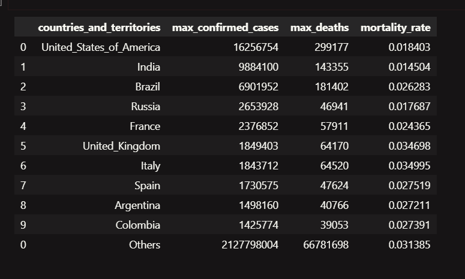
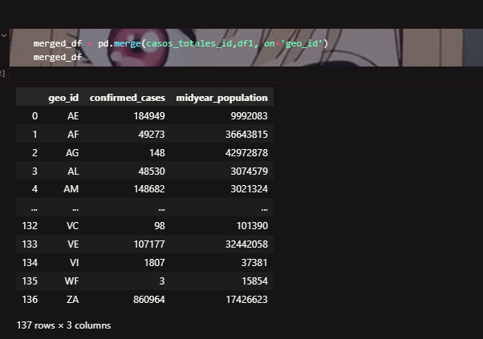

# Solemne1_MineriadeDatos
## Limpieza y Extracción de Datos de COVID-19 desde BigQuery con Google Cloud

Este proyecto proporciona herramientas y scripts para limpiar y extraer datos relacionados con el COVID-19 desde BigQuery utilizando la plataforma Google Cloud.

## Tabla de Contenidos
1. [Requeriments](#Requeriments)
2. [Configuración](#configuración)
3. [Uso](#uso)
4. [Resultados de Analisis y Merges](#Resultado de Analisis y Merges)
5. [Contribución](#contribución)

## Requeriments

## Instalación

Para instalar las dependencias necesarias, puedes utilizar pip, el gestor de paquetes de Python. Asegúrate de tener Python y pip instalados en tu sistema antes de comenzar.

1. **numpy**: Puedes instalar numpy ejecutando el siguiente comando en tu terminal o símbolo del sistema:

    ```bash
    pip install numpy
    ```

2. **geopandas**: Para instalar geopandas, puedes utilizar pip también:

    ```bash
    pip install geopandas
    ```

3. **matplotlib.pyplot**: matplotlib.pyplot es parte de la librería matplotlib, así que puedes instalarlo de la siguiente manera:

    ```bash
    pip install matplotlib
    ```

4. **google-cloud**: Para instalar la biblioteca de Google Cloud, puedes utilizar el siguiente comando:

    ```bash
    pip install google-cloud
    ```

    Antes de comenzar a usar la biblioteca de Google Cloud, necesitas inicializar un repositorio Git en tu proyecto. Si aún no has inicializado un repositorio Git, puedes hacerlo ejecutando el siguiente comando en el directorio de tu proyecto:

    ```bash
    git init
    ```

5. **Autenticación con Google Cloud**: Para autenticarte con Google Cloud, necesitas tener instalado Google Cloud SDK. Puedes instalarlo siguiendo las instrucciones en la [documentación oficial de Google Cloud SDK](https://cloud.google.com/sdk/docs/install).

    Después de instalar Google Cloud SDK, puedes autenticarte ejecutando el siguiente comando en tu terminal o símbolo del sistema:

    ```bash
    gcloud auth login
    ```

    Este comando abrirá una ventana del navegador donde podrás seleccionar tu cuenta de Google y autorizar el acceso a Google Cloud.

    Luego, para configurar la autenticación predeterminada, ejecuta:

    ```bash
    gcloud auth application-default login
    ```

Estos comandos te permitirán autenticarte con Google Cloud y configurar la autenticación predeterminada para tu proyecto. Asegúrate de seguir las instrucciones adicionales que puedan aparecer durante el proceso de autenticación para completar correctamente la configuración.

## Uso

El objetivo principal de este proyecto es limpiar y extraer mediante consultas SQL datos relacionados con el COVID-19 desde BigQuery utilizando la plataforma Google Cloud. 


- **Extracción de datos de BigQuery**:  SQL permite extraer datos de BigQuery utilizando consultas SQL personalizadas. Los usuarios pueden especificar consultas específicas para obtener datos relevantes sobre el COVID-19, como casos confirmados, muertes, pruebas realizadas, etc.


Despues de una consulta SQL y Uso de Pandas: 




## Resultados de Análisis y Merges

Este proyecto incluye análisis de datos y fusiones (merges) para identificar y mostrar los países más afectados por la pandemia de COVID-19. A continuación se describen brevemente estos aspectos:

- **Merges de Datos**: Utilizando herramientas de procesamiento de datos, se realizan fusiones (merges) de diferentes conjuntos de datos relacionados con el COVID-19 para combinar la información relevante en un único conjunto de datos completo. Esto permite una visualización y analisis de los contagios maximos con la cantidad de habitantes del pais.

- 

- **Análisis de Países Más Infectados**: Se lleva a cabo un análisis de los datos fusionados para identificar y mostrar los países más afectados por la pandemia en términos de casos confirmados, tasas de mortalidad, pruebas realizadas, entre otros. Los resultados de este análisis se presentan de manera clara y concisa, proporcionando información útil sobre la situación del COVID-19 en todo el mundo.

Estos análisis y fusiones de datos contribuyen a una mejor comprensión de la propagación del virus y sus impactos en diferentes países, lo que puede ser útil para la toma de decisiones en salud pública y la implementación de medidas preventivas.


